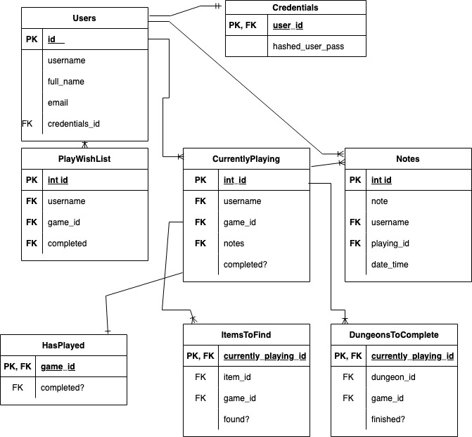

# Legend of Zelda - Progress Tracker & Gaming Reference
**Project Proposal**
## OVERVIEW

A Legend of Zelda reference guide which will contain details on every Zelda game with help from a Zelda API - such as items, dungeons, bosses, locations. It will allow users to track their progress in the game they are currently playing, add games to a ‘Want to Play’ wishlist and utilize the YouTube API so that users can find dungeon guides, trivia, or fun fan-theories.

## Goals

1. Allow progress tracking in the form of Item/Dungeon Checklists for specific games, and notes to be added by the player so they can easily pick up where they left off. It can be hard to remember what items the player was in the process of getting after a long game play break.

2. Allow for easy searching of video game guides, trivia, and fan-theories on mysterious areas. 

## DEMOGRAPHIC

Gamers and Fans of the Legend of Zelda - The Zelda Franchise has been around since 1986, and the most recent installment in the series is on its way with an estimated release sometime in Spring 2023, bringing in new fans from school age to older adults of diverse backgrounds, ages, and genders.

## DATA

The plan is to use this free Zelda API: https://docs.zelda-a,  in tandem with the YouTube API https://developers.google.com/youtube/v3

Most of the information will come from the Zelda API and will be used to help formulate searches with the YouTube API

## APPROACH

I will need to create a PostGres database and probably start with the users/login functionality first, as well as the general home page which will list all games, and individual game pages.. Then, I would need to implement adding ‘want to play wishlist’, and ‘currently playing’ tables with their associated notes and checklists, and the functionality for searching game/dungeon guides, and extraneous fun videos that are not always related to game play.

### *Tentative Schema*:

### *Potential Issue 1*:

The Zelda API does not have a specific place to directly fetch lists of items or dungeons associated with specific games. However this information appears in the data under ‘appearances’ in a url. I will need to find a way to filter out the correct items/dungeons, as well as things like bosses and places in other areas of the site.

### *Potential Issue 2*:

Since the API is fan-made it’s possible there may be missing data. It may be useful to add functionality where users can be allowed to add missing info to the game journal.

### *Sensitive Info*: 
User passwords will need to be secured with bcrypt.

### *Functionality*:

An interactive progress tracker and video game reference. All CRUD operations - adding notes, adding items to wishlist, removing notes/wishlist items, but also the ability to search for useful video content and find helpful information about specific Zelda games.

### *User Flow*:

Users who are not logged in will be able to see the general game list, but will not be able to interact otherwise.

Create Account > Browse Games > Add a game to the Wish List or Currently Playing list from the general list of games or from an individual game page. This action will redirect the user to the appropriate list. The Wish List will only show a list of titles, which will link back to game details. The Wish List will also show whether or not game a has been played before.

If the game on the wishlist is added to the Currently Playing list, it will be removed from the wishlist. From the Currently Playing List, users can navigate to a Game Journal page where they can add notes, add a list of game related items they need to find. The user will also be able to search for YouTube video game guides on this Journal page via a find guide button, search for game theories with a find theories button, or trivia with a find trivia button. 
