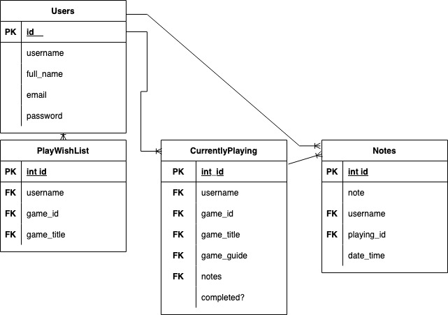

# Legend of Zelda - Progress Tracker & Gaming Reference

## Deployed on Heroku

https://zelda-progress-tracker.herokuapp.com/games

## Description

A place for Legend of Zelda players to keep track of the games they are currently playing, and want to play. Add notes on games, bookmark guides for full games, or individual dungeons, bosses, places, and items. 

Users can also peruse imaginative games theories (regarding games, dungeons, bosses, places, items) from Zelda YouTubers.

## Features

- Play Journal / Game Journal 
    - Users can start a journal for any game.
    - The journal has a place to add notes, bookmark a video or text guide, mark games as finished. Bookmarked video guides can be played here, so players do not have to leave the page, but can take notes as they go along.

- Find guides based on the game title, or get more specific.
    - Players can search the provided lists (Bosses, Dungeons, Items, Places) and find guides related to the part of the game they need a guide for and add these to the desired play journal.
- Wishlist
    - A place to book mark games to play later

- Playing Now List
    - See all games in progress
    - See all finished games

- Find theory videos (pure entertainment value)

All of these features were added because I personally often have several Zelda games in play at once, and sometimes have to walk away from them for months at a time, and then forget whats quests I was doing/finished. Breath of the Wild has it's own way of keeping track of these things for the player, but other Zelda games don't offer this in quite the same level of detail.

## User Flow

1. Sign Up
2. View the games page which prompts the player to pick any game to get started.
3. Once a game is picked add to the playing now list, wishlist, or simply find a theory.
4. Adding to the playing now list redirects you to that list, adding to the wishlist show the player the wishlist.
5. In the playing now list clicking on edit journal will take the player to journal page where they can start adding notes, book marking guides(video or a player curated text guide), and when done mark the game as finished.
6. If the player needs to book mark a more specific guide they can use the dropdown to navigate to a category and search the category. If there is a game or games on the playing list the player can choose which one to put the guide into. If there is no game in the playing list, adding a guide will not be possible.

## API's

All the data regarding Games, Bosses, Dungeons, Places, Items comes from the **Zelda API: https://docs.zelda-api.apius.cc/**

The data from the Zelda API is then used to help formulate search queries via the YouTube API and find embeddable videos for the player to bookmark. It is limited to the top 10 results. **YouTube API: https://developers.google.com/youtube/v3**

## Technology Stack

- Flask
- Bcrypt for passwords
- Python
- Some Javascript
- HTML/CSS

## Features that are missing but will be added later

- Password/Account Recovery (Keep track of those passwords for the time being!)
- Better handling of duplicate games (these were purposefully allowed as some games have now been released several times just on different platforms but this may be confusing if multiples of the same game are added to the list but are unfinished)
- Item/Dungeon checklists were not implemented as the API data is incomplete in some places, and it feels redundant to add since the user can use the notepad to serve the same purpose.

## Schema

